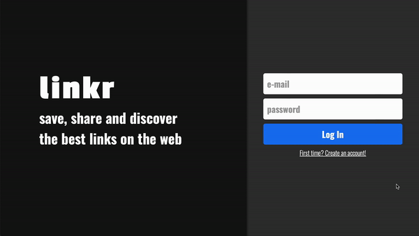

# LinkrBack

Design of a social media application ! With the right to register, login, comment, like, post, search for users, filter by hashtags and more !



Try it out now [here](https://linkr-iota.vercel.app) <br/>
Check out the frontend too [here](https://github.com/jao45gg/linkr)

## About

This is the Back-end of Linkr full-stack web application ! It's responsive, and does have data persistence, fell free to use and abuse it !

Below are the implemented features:

- Sign Up
- Login
- LogOut
- Search for user by name
- Filter posts by hashtag
- Follow/Unfollow user
- Delete your post
- Edit your post
- Much more !
  
By using this app any user can share a link on the internet and comment about it !

## Technologies
The following tools and frameworks were used in the construction of the project, you can find the full list on the package.json:<br>
<p>
  
  
  
  
  
  
  
  

  
</p>

## How to run

1. Clone this repository
2. Install dependencies
```bash
npm i
```
3. Create a .env file on the root of the project with the following variables
```bash
ACCESS_TOKEN_SECRET=yourSecret
DATABASE_URL=yourDataBaseURL
PORT=YourBackEndPORT (optional, default is 5005)
MODE=prod (ONLY WHEN IN PRODUCTION)
REFRESH_TOKEN_SECRET=yourSecret
```
3. Run the back-end with
```bash
npm start
```
4. You can optionally run the project with auto reload after changes
```bash
npm run dev
```
5. Finally send a request to http://localhost:YourBackEndPORT/SomeRouteImplemented and see it running !
